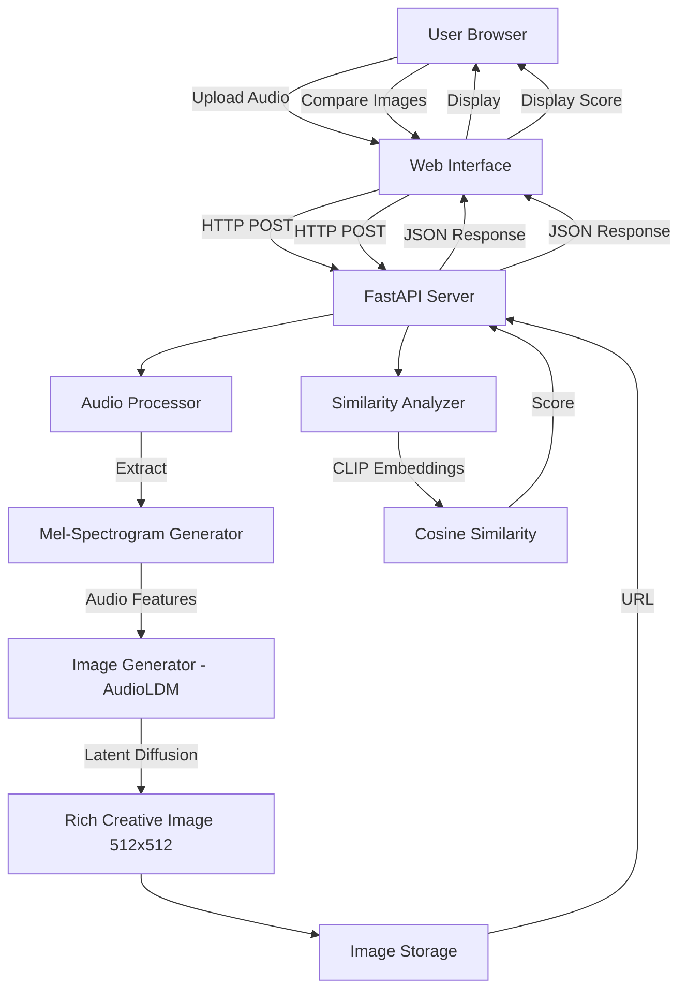

# Design Document: Voice to Image Representation & Similarity Detection System

## Overview

The Voice to Image Representation & Similarity Detection system converts audio input directly into rich, creative visual images using generative AI and performs similarity analysis on generated images. The system architecture consists of three main processing layers:

1. **Audio Processing Layer**: Extracts mel-spectrograms from audio files using Librosa
2. **Image Generation Layer**: Converts audio features into high-quality, creative images using AudioLDM (Audio Latent Diffusion Model)
3. **Similarity Analysis Layer**: Compares images using CLIP embeddings

The system is built with a FastAPI backend serving RESTful endpoints and a modern web interface for user interaction. All processing happens locally without external API dependencies.

### Key Design Decisions

- **Direct Audio-to-Image**: No text intermediary; audio features (mel-spectrograms) are used to condition a latent diffusion model
- **Generative AI Approach**: Use AudioLDM for creating rich, photorealistic or artistic images (512x512 resolution)
- **Pretrained Models**: Leverage AudioLDM for image generation and CLIP for similarity analysis
- **Stateless API**: Each request is independent; images are stored temporarily with session-based cleanup
- **Asynchronous Processing**: FastAPI async endpoints for handling I/O-bound operations efficiently
- **GPU Acceleration**: Optimized for GPU inference with CPU fallback support

## Architecture



### Component Interaction Flow

1. **Upload Flow**: User uploads audio → Web UI sends to API → Audio Processor validates → Mel-spectrogram extracted → Audio features converted to embedding → AudioLDM generates rich creative image → Stored and URL returned
2. **Comparison Flow**: User requests comparison → Web UI sends image IDs → Similarity Analyzer computes CLIP embeddings → Cosine similarity calculated → Score returned

## Components and Interfaces

### 1. Audio Processor Module

**Responsibility**: Validate audio files and extract spectrograms

**Interface**:
```python
class AudioProcessor:
    def validate_audio(file_path: str) -> ValidationResult
    def load_audio(file_path: str, sample_rate: int = 22050) -> AudioData
    def extract_spectrogram(audio_data: AudioData) -> Spectrogram
```

**Implementation Details**:
- Use Librosa for audio loading: `librosa.load(file_path, sr=sample_rate)`
- Extract mel-spectrogram: `librosa.feature.melspectrogram(y=audio, sr=sr, n_fft=2048, hop_length=512, n_mels=128)`
- Convert to log scale: `librosa.power_to_db(mel_spec, ref=np.max)`
- Normalize to [0, 1] range for consistent image generation input
- Validate file format using file extension and magic number checking
- Enforce 30-second maximum duration by checking `len(audio) / sample_rate`

**Configuration**:
- Sample rate: 22050 Hz (standard for speech)
- n_fft: 2048 (frequency resolution)
- hop_length: 512 (time resolution)
- n_mels: 128 (mel frequency bins)

### 2. Image Generator Module

**Responsibility**: Convert audio features into rich, creative visual images using pretrained generative AI models

**Interface**:
```python
class ImageGenerator:
    def __init__(model_name: str = "cvssp/audioldm-s-full-v2")
    def load_model() -> DiffusionPipeline
    def extract_audio_features(spectrogram: Spectrogram) -> AudioEmbedding
    def generate_image(audio_embedding: AudioEmbedding, guidance_scale: float = 7.5) -> Image
    def save_image(image: Image, output_path: str) -> str
```

**Implementation Details**:

**Model Architecture**: Use **AudioLDM** (Audio Latent Diffusion Model) for generating rich, creative images from audio input.

**Why AudioLDM**:
- Pretrained model specifically designed for audio-to-image generation
- Uses latent diffusion for high-quality, photorealistic or artistic outputs
- Works directly with audio features (spectrograms/mel-spectrograms)
- Produces 512x512 resolution images (can be upscaled to 1024x1024)
- Runnable on consumer GPUs (4GB+ VRAM) with reasonable inference time
- Available via Hugging Face Diffusers library

**Model Selection**: `cvssp/audioldm-s-full-v2`
- Small variant for faster inference (~3-5 seconds per image on GPU)
- Full variant available for higher quality: `cvssp/audioldm-l-full`
- Alternative: `stabilityai/stable-diffusion-2-1` with custom audio conditioning

**Implementation Approach**:

```python
from diffusers import AudioLDMPipeline
import torch

class ImageGenerator:
    def __init__(self, model_name="cvssp/audioldm-s-full-v2", device="cuda"):
        self.device = device if torch.cuda.is_available() else "cpu"
        self.model_name = model_name
        self.pipeline = None
    
    def load_model(self):
        """Load AudioLDM pipeline with optimizations"""
        self.pipeline = AudioLDMPipeline.from_pretrained(
            self.model_name,
            torch_dtype=torch.float16 if self.device == "cuda" else torch.float32
        )
        self.pipeline = self.pipeline.to(self.device)
        
        # Enable memory optimizations
        if self.device == "cuda":
            self.pipeline.enable_attention_slicing()
            self.pipeline.enable_vae_slicing()
        
        return self.pipeline
    
    def extract_audio_features(self, spectrogram):
        """Convert mel-spectrogram to audio embedding for conditioning"""
        # AudioLDM expects mel-spectrogram as conditioning input
        # Normalize and reshape to expected format
        mel_spec_normalized = (spectrogram.data - spectrogram.data.min()) / \
                              (spectrogram.data.max() - spectrogram.data.min())
        
        # Convert to tensor format expected by AudioLDM
        audio_embedding = torch.from_numpy(mel_spec_normalized).float()
        audio_embedding = audio_embedding.unsqueeze(0)  # Add batch dimension
        
        return audio_embedding
    
    def generate_image(self, audio_embedding, guidance_scale=7.5, num_inference_steps=50):
        """Generate rich, creative image from audio embedding"""
        with torch.no_grad():
            # AudioLDM generates images conditioned on audio features
            output = self.pipeline(
                audio_embedding=audio_embedding,
                guidance_scale=guidance_scale,
                num_inference_steps=num_inference_steps,
                height=512,
                width=512
            )
            
            image = output.images[0]  # PIL Image
        
        return image
    
    def save_image(self, image, output_path):
        """Save generated image to disk"""
        image.save(output_path, format='PNG', optimize=True)
        return output_path
```

**Alternative Approach - Stable Diffusion with Audio Conditioning**:

If AudioLDM is not suitable, use Stable Diffusion with custom audio conditioning:

```python
from diffusers import StableDiffusionPipeline, AutoencoderKL
import torch

class ImageGenerator:
    def __init__(self, model_name="stabilityai/stable-diffusion-2-1"):
        self.device = "cuda" if torch.cuda.is_available() else "cpu"
        self.pipeline = StableDiffusionPipeline.from_pretrained(
            model_name,
            torch_dtype=torch.float16 if self.device == "cuda" else torch.float32
        ).to(self.device)
    
    def generate_image(self, spectrogram, guidance_scale=7.5):
        """Generate image using spectrogram as visual conditioning"""
        # Convert spectrogram to RGB image for ControlNet-style conditioning
        spec_image = self._spectrogram_to_rgb(spectrogram)
        
        # Use spectrogram as init_image with low strength for creative variation
        output = self.pipeline(
            prompt="abstract visualization, colorful, artistic, detailed",
            image=spec_image,
            strength=0.7,  # Allow creative deviation from spectrogram
            guidance_scale=guidance_scale,
            num_inference_steps=50
        )
        
        return output.images[0]
    
    def _spectrogram_to_rgb(self, spectrogram):
        """Convert spectrogram to RGB image for conditioning"""
        import matplotlib.pyplot as plt
        from matplotlib.backends.backend_agg import FigureCanvasAgg
        
        fig, ax = plt.subplots(figsize=(5.12, 5.12), dpi=100)
        ax.imshow(spectrogram.data, aspect='auto', origin='lower', cmap='viridis')
        ax.axis('off')
        
        canvas = FigureCanvasAgg(fig)
        canvas.draw()
        image = np.frombuffer(canvas.tostring_rgb(), dtype='uint8')
        image = image.reshape(512, 512, 3)
        plt.close(fig)
        
        return Image.fromarray(image)
```

**Recommended Approach**: Use AudioLDM as the primary method, with Stable Diffusion as a fallback.

**Generation Parameters**:
- **guidance_scale**: 7.5 (controls adherence to audio features vs. creativity)
- **num_inference_steps**: 50 (balance between quality and speed)
- **height/width**: 512x512 pixels (standard for diffusion models)
- **seed**: Optional for reproducibility (can be set for deterministic output)

**Image Format**:
- Output: PNG format (lossless)
- Dimensions: 512x512 pixels (can be upscaled to 1024x1024 if needed)
- Color space: RGB
- Quality: High-resolution, photorealistic or artistic depending on audio input

**Performance Considerations**:
- GPU inference: ~3-5 seconds per image (with CUDA)
- CPU inference: ~30-60 seconds per image (not recommended for production)
- Memory requirements: 4GB+ VRAM for GPU, 8GB+ RAM for CPU
- Model size: ~2-4GB download (cached after first use)

**Determinism Control**:
- Set fixed seed for reproducible outputs: `torch.manual_seed(42)`
- Without seed, outputs will vary slightly between runs (creative variation)
- For similarity testing, determinism can be enabled via seed parameter

### 3. Similarity Analyzer Module

**Responsibility**: Compare generated images using CLIP embeddings

**Interface**:
```python
class SimilarityAnalyzer:
    def __init__(model_name: str = "openai/clip-vit-base-patch32")
    def load_clip_model() -> CLIPModel
    def compute_embedding(image: Image) -> Embedding
    def calculate_similarity(embedding1: Embedding, embedding2: Embedding) -> float
```

**Implementation Details**:
- Use Hugging Face Transformers library for CLIP
- Model: `CLIPModel.from_pretrained("openai/clip-vit-base-patch32")`
- Processor: `CLIPProcessor.from_pretrained("openai/clip-vit-base-patch32")`
- Embedding extraction:
  ```python
  inputs = processor(images=image, return_tensors="pt")
  with torch.no_grad():
      image_features = model.get_image_features(**inputs)
      embedding = image_features / image_features.norm(dim=-1, keepdim=True)
  ```
- Similarity calculation: Cosine similarity using `torch.nn.functional.cosine_similarity`
- Return value: Float between 0.0 (completely different) and 1.0 (identical)

**Optimization**:
- Cache embeddings for previously processed images
- Use batch processing if comparing multiple image pairs

### 4. FastAPI Server

**Responsibility**: Expose RESTful endpoints and orchestrate processing pipeline

**Endpoints**:

```python
POST /api/generate
  Request: multipart/form-data with audio file
  Response: {
    "image_id": "uuid",
    "image_url": "/api/images/{uuid}",
    "processing_time": 2.34
  }

POST /api/compare
  Request: {
    "image_id_1": "uuid1",
    "image_id_2": "uuid2"
  }
  Response: {
    "similarity_score": 0.87,
    "percentage": "87%"
  }

GET /api/images/{image_id}
  Response: Image file (PNG)

GET /api/health
  Response: {"status": "healthy", "models_loaded": true}
```

**Implementation Details**:
- Use `FastAPI` with `uvicorn` ASGI server
- Async endpoints for I/O operations: `async def generate(...)`
- File upload handling: `UploadFile` type from FastAPI
- Temporary file storage: Use `tempfile` module for audio files
- Image storage: In-memory dict or filesystem with UUID keys
- CORS middleware: Enable for local development
- Error handling: Custom exception handlers for validation and processing errors

**Startup Sequence**:
1. Detect GPU availability (CUDA)
2. Load AudioLDM model into memory (GPU or CPU)
3. Load CLIP model into memory
4. Initialize image storage directory
5. Verify Librosa installation
6. Start server on localhost:8000

**Model Loading Optimization**:
- Use `torch.float16` for GPU inference (faster, less memory)
- Enable attention slicing and VAE slicing for memory efficiency
- Cache models in `~/.cache/huggingface/` for faster subsequent loads

### 5. Web Interface

**Responsibility**: Provide user-friendly interface for audio upload and result visualization

**Technology Stack**:
- HTML5 for structure
- CSS3 with modern styling (flexbox/grid)
- Vanilla JavaScript for interactivity (no framework required for MVP)
- Fetch API for HTTP requests

**UI Components**:

**Upload Section**:
- Drag-and-drop zone for audio files
- File input button as fallback
- Supported formats display: "WAV, MP3, FLAC, OGG"
- File validation feedback (size, format)
- Upload progress indicator

**Results Display**:
- Grid layout for multiple generated images
- Image cards with:
  - Generated image preview
  - Audio filename
  - Processing time
  - Select checkbox for comparison
- Responsive design (mobile-friendly)

**Comparison Section**:
- Side-by-side image display
- Similarity score visualization:
  - Percentage text (large, prominent)
  - Progress bar/gauge
  - Color coding: Red (<30%), Yellow (30-70%), Green (>70%)
- "Compare Selected" button (enabled when 2 images selected)

**Styling Approach**:
- Modern, clean aesthetic
- Dark mode option
- Smooth animations for state transitions
- Loading spinners during processing
- Toast notifications for errors/success

**Example Layout**:
```
┌─────────────────────────────────────────┐
│  Voice to Image System                  │
├─────────────────────────────────────────┤
│  ┌───────────────────────────────────┐  │
│  │  Drag & Drop Audio File Here      │  │
│  │  or click to browse               │  │
│  │  (WAV, MP3, FLAC, OGG)           │  │
│  └───────────────────────────────────┘  │
├─────────────────────────────────────────┤
│  Generated Images:                      │
│  ┌─────┐  ┌─────┐  ┌─────┐            │
│  │ ☐   │  │ ☐   │  │ ☐   │            │
│  │ IMG │  │ IMG │  │ IMG │            │
│  └─────┘  └─────┘  └─────┘            │
│                                         │
│  [Compare Selected Images]              │
├─────────────────────────────────────────┤
│  Similarity: 87%  ████████░░            │
│  ┌─────┐         ┌─────┐               │
│  │IMG1 │         │IMG2 │               │
│  └─────┘         └─────┘               │
└─────────────────────────────────────────┘
```

## Data Models

### AudioData
```python
@dataclass
class AudioData:
    samples: np.ndarray      # Audio samples
    sample_rate: int         # Sampling rate (Hz)
    duration: float          # Duration in seconds
    file_path: str          # Original file path
```

### Spectrogram
```python
@dataclass
class Spectrogram:
    data: np.ndarray        # 2D array (n_mels x time_steps)
    sample_rate: int        # Original audio sample rate
    hop_length: int         # Hop length used
    n_mels: int            # Number of mel bands
```

### AudioEmbedding
```python
@dataclass
class AudioEmbedding:
    embedding: torch.Tensor  # Audio feature tensor for conditioning
    shape: tuple            # Embedding dimensions
    device: str             # 'cuda' or 'cpu'
```

### GeneratedImage
```python
@dataclass
class GeneratedImage:
    image_id: str          # UUID
    image_data: Image      # PIL Image object (512x512 RGB)
    file_path: str         # Saved file path
    created_at: datetime   # Timestamp
    source_audio: str      # Original audio filename
    generation_params: dict # guidance_scale, num_inference_steps, seed
```

### SimilarityResult
```python
@dataclass
class SimilarityResult:
    image_id_1: str
    image_id_2: str
    similarity_score: float  # 0.0 to 1.0
    embedding_1: np.ndarray  # Cached for reuse
    embedding_2: np.ndarray
```

### ValidationResult
```python
@dataclass
class ValidationResult:
    is_valid: bool
    error_message: Optional[str]
    file_format: Optional[str]
    duration: Optional[float]
```

## Correctness Properties

*A property is a characteristic or behavior that should hold true across all valid executions of a system—essentially, a formal statement about what the system should do. Properties serve as the bridge between human-readable specifications and machine-verifiable correctness guarantees.*


### Property 1: Valid Audio Processing
*For any* valid audio file in supported formats (WAV, MP3, FLAC, OGG), validation should succeed and the audio should load without errors.
**Validates: Requirements 1.1, 1.3**

### Property 2: Invalid Format Rejection
*For any* file with an unsupported audio format, the system should return a descriptive error message indicating the format is not supported.
**Validates: Requirements 1.2**

### Property 3: Duration Limit Enforcement
*For any* audio file with duration up to 30 seconds, the system should process it successfully; for any audio exceeding 30 seconds, the system should reject it with an appropriate error.
**Validates: Requirements 1.4**

### Property 4: Spectrogram Extraction Consistency
*For any* valid audio data, extracting a mel-spectrogram should produce a 2D numpy array with normalized values in a consistent scale.
**Validates: Requirements 2.1, 2.3, 2.4**

### Property 5: Spectrogram Determinism
*For any* valid audio input, extracting the spectrogram multiple times should produce identical outputs (deterministic processing).
**Validates: Requirements 2.5**

### Property 6: Image Generation Success
*For any* valid audio embedding, the AudioLDM generator should produce a high-quality RGB image in PNG format with dimensions of 512x512 pixels.
**Validates: Requirements 3.1, 3.3**

### Property 7: Image Generation Quality
*For any* audio embedding, the generated image should be visually rich and creative (not a simple visualization), with diverse colors and detailed features.
**Validates: Requirements 3.4**

### Property 8: Similarity Score Range
*For any* two generated images, the similarity analyzer should compute CLIP embeddings and return a similarity score between 0.0 and 1.0 (inclusive).
**Validates: Requirements 4.1, 4.2**

### Property 9: API Success Response Format
*For any* successful API request, the server should return HTTP status 200 with a valid JSON response containing the expected fields.
**Validates: Requirements 5.3, 5.7**

### Property 10: API Error Response Format
*For any* API request with invalid input, the server should return HTTP status 400 with a JSON response containing error details.
**Validates: Requirements 5.4**

### Property 11: Pipeline Execution Order
*For any* uploaded audio file, the system should execute the processing pipeline in the correct order: validation → spectrogram extraction → image generation, with each stage completing before the next begins.
**Validates: Requirements 6.1**

### Property 12: Pipeline Error Reporting
*For any* pipeline execution that fails at a specific stage, the system should return an error message clearly indicating which stage failed.
**Validates: Requirements 6.3**

### Property 13: Temporary File Cleanup
*For any* completed processing request (successful or failed), the system should clean up all temporary files created during processing.
**Validates: Requirements 6.4**

### Property 14: Concurrent Request Safety
*For any* set of concurrent API requests, the system should process them without data corruption, ensuring each request produces correct independent results.
**Validates: Requirements 6.5**

### Property 15: Unique Image Identifiers
*For any* set of generated images, each should be stored with a unique identifier (UUID), ensuring no ID collisions occur.
**Validates: Requirements 7.1**

### Property 16: Image URL Accessibility
*For any* stored image, the system should provide a valid URL that can be used to retrieve the image via HTTP GET request.
**Validates: Requirements 7.2, 7.3**

### Property 17: Image Response Headers
*For any* image retrieval request, the server should return the image with appropriate content-type headers (image/png).
**Validates: Requirements 7.4**

### Property 18: Model Caching
*For any* sequence of requests, pretrained models (CLIP) should be loaded once at startup and reused for all subsequent requests without reloading.
**Validates: Requirements 11.4**

## Error Handling

### Error Categories

**1. Validation Errors (HTTP 400)**:
- Unsupported audio format
- Audio file too large (>30 seconds)
- Missing required fields in API request
- Invalid image IDs for comparison

**2. Processing Errors (HTTP 500)**:
- Spectrogram extraction failure
- AudioLDM model inference failure
- Image generation failure (out of memory, CUDA errors)
- CLIP embedding computation failure
- File I/O errors

**3. Resource Errors (HTTP 503)**:
- Models not loaded
- Out of GPU memory (CUDA OOM)
- Out of system memory
- Disk space exhausted
- GPU not available when required

### Error Response Format

All errors return JSON with consistent structure:
```json
{
  "error": {
    "code": "INVALID_AUDIO_FORMAT",
    "message": "Unsupported audio format: .aac. Supported formats: WAV, MP3, FLAC, OGG",
    "stage": "validation",
    "timestamp": "2024-01-15T10:30:00Z"
  }
}
```

### Error Handling Strategy

**Audio Processing**:
- Wrap Librosa calls in try-except blocks
- Catch `librosa.util.exceptions.ParameterError` for invalid audio
- Validate file existence before processing
- Check audio duration before spectrogram extraction

**Image Generation**:
- Validate audio embedding shape and data type
- Handle AudioLDM inference errors gracefully
- Catch CUDA out-of-memory errors and suggest CPU fallback
- Handle torch tensor dimension mismatches
- Ensure output directory exists and is writable
- Implement timeout for long-running generation (>60 seconds)

**Similarity Analysis**:
- Validate image IDs exist before comparison
- Handle CLIP model inference errors
- Catch tensor dimension mismatches

**API Layer**:
- Use FastAPI's built-in validation for request models
- Custom exception handlers for domain-specific errors
- Logging for all errors with stack traces

### Cleanup and Resource Management

- Use context managers for file operations
- Implement cleanup in `finally` blocks
- Background task for periodic cleanup of old images
- Graceful shutdown handler to clean up resources

## Testing Strategy

### Dual Testing Approach

The system requires both unit tests and property-based tests for comprehensive coverage:

**Unit Tests**: Verify specific examples, edge cases, and error conditions
- Test specific audio files (silence, noise, speech)
- Test boundary conditions (exactly 30 seconds, 0 seconds)
- Test error paths (missing files, corrupted data)
- Test API endpoints with specific payloads
- Test integration between components

**Property-Based Tests**: Verify universal properties across all inputs
- Generate random audio data and verify processing
- Generate random spectrograms and verify image generation
- Generate random image pairs and verify similarity computation
- Test concurrent requests with random timing
- Verify determinism with repeated inputs

### Property-Based Testing Configuration

**Library**: Use `hypothesis` for Python property-based testing

**Configuration**:
- Minimum 100 iterations per property test
- Each test tagged with feature name and property number
- Tag format: `# Feature: voice-to-image-system, Property {N}: {property_text}`

**Example Property Test Structure**:
```python
from hypothesis import given, strategies as st
import hypothesis

@given(st.binary(min_size=1000, max_size=100000))
@hypothesis.settings(max_examples=100)
def test_property_5_spectrogram_determinism(audio_bytes):
    """
    Feature: voice-to-image-system, Property 5: Spectrogram Determinism
    For any valid audio input, extracting the spectrogram multiple times 
    should produce identical outputs.
    """
    # Test implementation
    pass
```

### Test Coverage Requirements

**Audio Processor Module**:
- Unit tests: 5-10 tests for specific formats and edge cases
- Property tests: 3 tests (Properties 1, 2, 3, 4, 5)

**Image Generator Module**:
- Unit tests: 3-5 tests for specific spectrograms
- Property tests: 2 tests (Properties 6, 7)

**Similarity Analyzer Module**:
- Unit tests: 3-5 tests including identical images edge case
- Property tests: 1 test (Property 8)

**API Server**:
- Unit tests: 10-15 tests for each endpoint and error case
- Property tests: 4 tests (Properties 9, 10, 11, 12)
- Integration tests: 5-10 tests for end-to-end flows

**System Integration**:
- Property tests: 4 tests (Properties 13, 14, 15, 16, 17, 18)

### Testing Tools

- **pytest**: Test runner and framework
- **hypothesis**: Property-based testing library
- **pytest-asyncio**: For testing async FastAPI endpoints
- **httpx**: For testing HTTP endpoints
- **pytest-cov**: For coverage reporting

### Continuous Testing

- Run unit tests on every code change
- Run property tests before commits
- Aim for >80% code coverage
- Monitor test execution time (property tests may be slower)

## Implementation Notes

### Dependencies

**Core Libraries**:
```
fastapi==0.104.1
uvicorn[standard]==0.24.0
librosa==0.10.1
numpy==1.24.3
pillow==10.1.0
torch==2.1.1
torchvision==0.16.1
diffusers==0.25.0
transformers==4.35.2
accelerate==0.25.0
scipy==1.11.4
```

**Testing Libraries**:
```
pytest==7.4.3
pytest-asyncio==0.21.1
hypothesis==6.92.1
httpx==0.25.2
pytest-cov==4.1.0
```

### Performance Considerations

- **Spectrogram Extraction**: ~0.5-1 second for 30-second audio
- **Image Generation** (AudioLDM on GPU): ~3-5 seconds per image
- **Image Generation** (AudioLDM on CPU): ~30-60 seconds per image (not recommended)
- **CLIP Embedding**: ~0.2-0.5 seconds per image
- **Total Pipeline** (GPU): ~4-7 seconds per audio file
- **Total Pipeline** (CPU): ~31-62 seconds per audio file

**Hardware Requirements**:
- **GPU (Recommended)**: NVIDIA GPU with 4GB+ VRAM (CUDA support)
- **CPU (Fallback)**: 8GB+ RAM, significantly slower inference
- **Storage**: ~4GB for model weights (cached after first download)
- **Disk Space**: ~100MB for temporary files and generated images

### Scalability Considerations

For MVP (localhost deployment):
- Single-threaded processing is acceptable
- In-memory image storage (limit to 100 images)
- No database required
- GPU recommended for reasonable inference times

For production scaling:
- Add Redis for image caching
- Use Celery for background processing queue
- Store images in S3 or similar object storage
- Add rate limiting (expensive GPU inference)
- Implement request queuing with priority
- Consider batch processing for multiple requests
- Use model serving infrastructure (TorchServe, TensorRT)

### Security Considerations

- Validate file uploads (size, type, content)
- Sanitize filenames to prevent path traversal
- Limit concurrent requests to prevent DoS
- Set maximum file size (e.g., 10MB)
- Use secure headers (CORS, CSP)

### Development Workflow

1. Set up Python virtual environment
2. Install PyTorch with CUDA support (if GPU available): `pip install torch torchvision --index-url https://download.pytorch.org/whl/cu118`
3. Install dependencies: `pip install -r requirements.txt`
4. Download models (auto-downloaded on first run, ~4GB):
   - AudioLDM: `cvssp/audioldm-s-full-v2`
   - CLIP: `openai/clip-vit-base-patch32`
5. Run tests: `pytest tests/`
6. Start server: `uvicorn main:app --reload`
7. Access UI: `http://localhost:8000`

**GPU Setup** (Recommended):
- Verify CUDA installation: `nvidia-smi`
- Check PyTorch CUDA: `python -c "import torch; print(torch.cuda.is_available())"`
- Expected output: `True`

### Project Structure

```
voice-to-image-system/
├── app/
│   ├── __init__.py
│   ├── main.py              # FastAPI app
│   ├── audio_processor.py   # Audio processing module
│   ├── image_generator.py   # Image generation module
│   ├── similarity_analyzer.py # Similarity analysis module
│   ├── models.py            # Data models
│   └── config.py            # Configuration
├── static/
│   ├── index.html           # Web interface
│   ├── styles.css           # Styling
│   └── app.js               # Frontend logic
├── tests/
│   ├── test_audio_processor.py
│   ├── test_image_generator.py
│   ├── test_similarity_analyzer.py
│   ├── test_api.py
│   └── test_properties.py   # Property-based tests
├── temp/                    # Temporary files (gitignored)
├── images/                  # Generated images (gitignored)
├── requirements.txt
├── README.md
└── .gitignore
```
